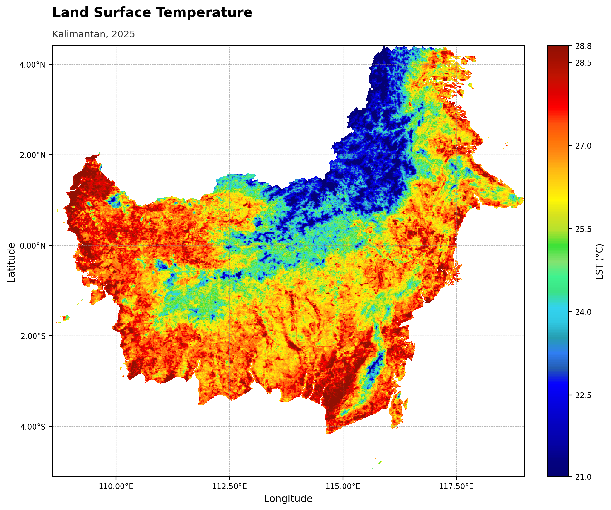
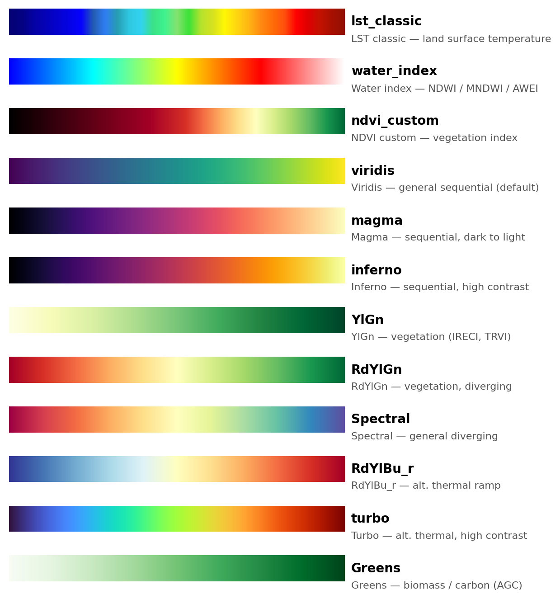

# continuous-raster-visualization
> **Note:** You just need to download click here [`continuous-raster-visualization.skill`](https://github.com/Defani/claude-skills-contious-geotiff-visualizations/raw/main/continuous-raster-visualization.skill) file.

A Claude Skill for rendering single-band, continuous-value georeferenced rasters
(GeoTIFF) into publication-style map figures, built for remote sensing workflows
such as LST, NDVI, IRECI, TRVI, and AGC outputs.

[](https://www.python.org/)
[](https://matplotlib.org/)
[](https://rasterio.readthedocs.io/)
[](https://numpy.org/)
[](SKILL.md)
[](https://claude.ai)
[](scripts/raster_viz.py)
[](#what-it-does)
[](#quick-start)
[](#language)
[](LICENSE)

## Demo



*Percentile stretch, `lst_classic` palette, left-aligned title, English labels — all current defaults.*

## Skill preview

An interactive, self-contained HTML preview of this skill (badges, palette
gallery, feature list, tech stack, and the demo above) is bundled at
[`assets/preview.html`](assets/preview.html) — download it and open it in any
browser, no server needed.

## Language

The first time this skill runs in a conversation, Claude asks which language to
use:

- **English** (default) — axis labels `Longitude`/`Latitude`, colorbar label
  `Pixel value`
- **Bahasa Indonesia** — axis labels `Bujur`/`Lintang`, colorbar label
  `Nilai piksel`

The choice only affects default label wording (you can always override any
label with `--xlabel`/`--ylabel`/`--colorbar-label`) and the language Claude
uses when talking about the visualization for the rest of the session. If you
already write to Claude in Indonesian, it infers the choice instead of asking.
Set it explicitly with `--language en` or `--language id` (or `language="id"`
in Python).

## What it does

Given a single-band GeoTIFF and a set of options, the skill produces one map
figure (PNG/PDF/SVG) with control over:

- Stretch: min-max, percentile (default 2-98%), or manual vmin/vmax
- Colormap: built-in domain palettes (`lst_classic`, `water_index`, `ndvi_custom`)
  or any matplotlib colormap (viridis, magma, YlGn, Spectral, and more)
- Colorbar orientation (vertical/horizontal), label position (side/top), tick
  count, and tick decimal precision — the two ends always show the actual data
  min/max used for the stretch, never rounded placeholder numbers
- Coordinate tick format for geographic rasters: DMS, DD, or plain decimal
- Gridlines on/off
- Font family (serif/sans-serif) and independent title/subtitle font sizes
- Title/subtitle spacing and alignment (left by default, or center)
- Output language for default labels: English or Bahasa Indonesia

An in-chat interactive settings picker (palette swatches, stretch, colorbar,
gridlines, font, etc.) is also available — Claude can render it as a widget so
you can pick options visually and apply them with one click instead of typing
flags.

## Settings reference

| Option | Choices | Default | Notes |
|---|---|---|---|
| `stretch` | `minmax`, `percentile`, `manual` | `percentile` (2–98%) | `manual` requires `vmin`/`vmax` |
| `pmin`/`pmax` | any 0–100 | `2`/`98` | only used when `stretch=percentile` |
| `cmap` | matplotlib colormap, or named palette (see gallery below) | `viridis` | pick a perceptually appropriate one for the variable |
| `colorbar_orient` | `vertical`, `horizontal` | `vertical` | |
| `colorbar_label` | free text | `Pixel value` | set to the actual unit, e.g. `LST (°C)`, `AGC (ton/ha)`, `NDVI` |
| `colorbar_label_position` | `side`, `top` | `side` | `side` = rotated label along the bar; `top` = unrotated label above the bar |
| `colorbar_nticks` | integer ≥2 | auto (~6) | controls how many ticks appear *between* the endpoints; endpoints always show the true stretch min/max |
| `colorbar_decimals` | integer ≥0 | auto (0/1/2 by span) | decimal places on tick labels — set explicitly (e.g. `0`) if the automatic rule looks inconsistent |
| `coord_format` | `DMS`, `DD`, `D` | `DD` | DMS = D°M'S″ + hemisphere; DD = decimal degrees + hemisphere; D = plain decimal, no symbol. Only affects geographic CRS |
| `gridlines` | on/off | on | dashed, light gray |
| `grid_step` | number (degrees/units) | auto | manual spacing between gridlines/ticks |
| `font` | `serif`, `sans-serif` | `sans-serif` | applies to the whole figure |
| `background` | any matplotlib color | `white` | |
| `title` / `subtitle` | free text | none | title is bold, subtitle is plain and smaller |
| `title_align` | `left`, `center` | `left` | aligned to the map's left edge when `left` |
| `title_fontsize` / `subtitle_fontsize` | number | `15` / `10.5` | |
| `title_gap` | number (axes-fraction) | `0.045` | vertical spacing between title and subtitle |
| `xlabel` / `ylabel` | free text | `Longitude`/`Latitude` (geographic) or `Easting`/`Northing` (projected) | |
| `language` | `en`, `id` | `en` | sets default axis/colorbar label wording |
| `figsize` | width height | `10 8` | inches |
| `dpi` | integer | `200` | |

## Available color palettes

Named domain palettes (built into the script) and commonly used matplotlib
colormaps — actual gradients rendered below, not just names:



| Palette | Type | Best for |
|---|---|---|
| `lst_classic` | named | Land surface temperature — classic GEE-style thermal ramp |
| `water_index` | named | Water/moisture indices — NDWI, MNDWI, AWEI |
| `ndvi_custom` | named | NDVI specifically — diverging ramp anchored to fixed values (-1.0 to 0.9) |
| `viridis` | matplotlib | General-purpose sequential, perceptually uniform (script default) |
| `magma` | matplotlib | Sequential, dark-to-light — temperature, intensity |
| `inferno` | matplotlib | Sequential, high contrast — temperature |
| `YlGn` | matplotlib | Vegetation indices other than NDVI (IRECI, TRVI) |
| `RdYlGn` | matplotlib | Vegetation indices, diverging red → green |
| `Spectral` | matplotlib | General diverging data |
| `RdYlBu_r` | matplotlib | Alternative thermal ramp |
| `turbo` | matplotlib | Alternative thermal ramp, high contrast |
| `Greens` | matplotlib | Biomass/carbon (AGC), sequential |

Any other built-in matplotlib colormap name also works — pass it directly to
`--cmap`.

## Files

```
continuous-raster-visualization/
  SKILL.md                 skill definition and usage guide
  scripts/raster_viz.py    the rendering engine (CLI + importable function)
  references/options.md    full parameter reference
  README.md                this file
  LICENSE                  MIT license
```

## Quick start

```bash
python3 scripts/raster_viz.py INPUT.tif OUTPUT.png \
    --stretch percentile --pmin 2 --pmax 98 \
    --cmap lst_classic \
    --colorbar-orient vertical --colorbar-label "LST (deg C)" \
    --colorbar-nticks 5 --colorbar-decimals 0 \
    --coord-format DD --gridlines \
    --font sans-serif \
    --title "Land Surface Temperature" --subtitle "Kalimantan, 2025"
```

Or from Python:

```python
from scripts.raster_viz import plot_raster

plot_raster(
    "INPUT.tif", "OUTPUT.png",
    stretch="percentile", pmin=2, pmax=98,
    cmap="lst_classic",
    colorbar_orient="vertical", colorbar_label="LST (deg C)",
    colorbar_nticks=5, colorbar_decimals=0,
    coord_format="DD", gridlines=True,
    font="sans-serif",
    title="Land Surface Temperature", subtitle="Kalimantan, 2025",
)
```

See `SKILL.md` for the full workflow Claude follows when using this skill, and
`references/options.md` for every parameter in detail.

## Engine

- **Rendering**: [matplotlib](https://matplotlib.org/) (figure, colormap, colorbar, typography)
- **Raster I/O**: [rasterio](https://rasterio.readthedocs.io/) (GeoTIFF reading, CRS, bounds, nodata handling)
- **Numerics**: [NumPy](https://numpy.org/) (stretch/percentile computation)
- **Orchestration**: Claude, via this Skill — inspects the raster, resolves
  options (asking only where genuinely ambiguous), calls `raster_viz.py`, and
  reviews the output before presenting it

## License

MIT. See [LICENSE](LICENSE).
